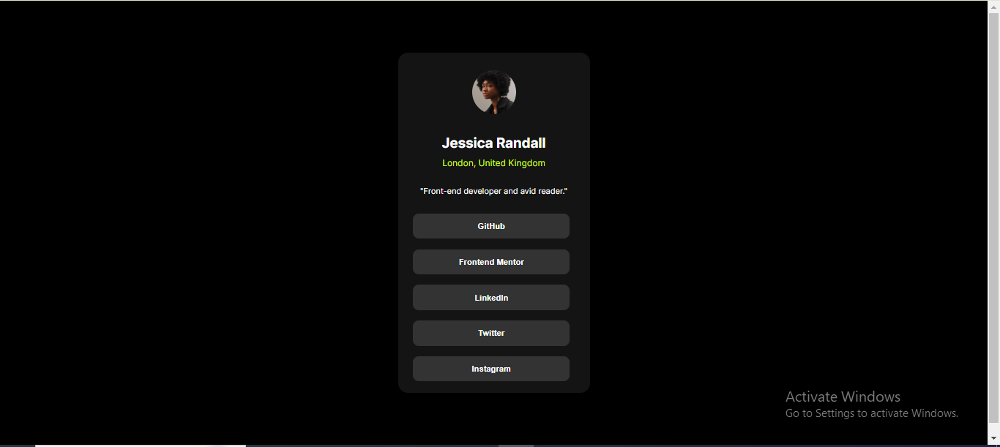

# Frontend Mentor - Social links profile solution

This is a solution to the [Social links profile challenge on Frontend Mentor](https://www.frontendmentor.io/challenges/social-links-profile-UG32l9m6dQ). 

## Table of contents

- [Overview](#overview)
  - [The challenge](#the-challenge)
  - [Screenshot](#screenshot)
  - [Links](#links)
- [My process](#my-process)
  - [Built with](#built-with)
  - [What I learned](#what-i-learned)
  - [Continued development](#continued-development)
- [Author](#author)

## Overview

### The challenge

Users should be able to:

- See hover and focus states for all interactive elements on the page

### Screenshot

### Links

- Solution URL: [Git Repo Link](https://github.com/KrishnaPoddar1/sociallinkcardtemplate.git)
- Live Site URL: [Add live site URL here](https://krishnapoddar1.github.io/sociallinkcardtemplate/)

## My process

### Built with

- Semantic HTML5 markup
- CSS custom properties
- Flexbox
- Mobile-first workflow
- Visual Studio Code

### What I learned

Learned about the property font-variation-settings in the font-family. Used the root directory for the first time in a real project. 

To see how you can add code snippets, see below:

### Continued development

On the utilization of Grid.

## Author

- Frontend Mentor - [@KrishnaPoddar1](https://www.frontendmentor.io/profile/KrishnaPoddar1)
